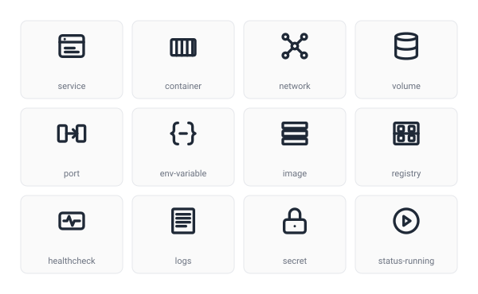

# SVG Art portfolio

A clean, consistent line-icon set for **Docker Compose and DevOps**. It contains containers, services, networks, volumes, ports, secrets and more. Brand-free conceptual symbols designed for technical documentation, dashboards and developer tooling.

<picture>
  <source media="(prefers-color-scheme: dark)" srcset="preview-dark.svg">
  
</picture>

## About

Every icon shares the same visual language so they work as a cohesive pack, not isolated pieces. The set is built on a strict 24×24 grid with a 2px stroke, rounded line caps and joins, and uses `currentColor` so icons recolor cleanly in any UI or documentation.

This repository contains a **free sample of 12 icons** released under the MIT License. The complete pack of **40 icons** covering the full Docker Compose and DevOps vocabulary is available for purchase (see [License & scope](#license--scope)).

## Specifications

| Property        | Value                                   |
| --------------- | --------------------------------------- |
| Format          | SVG                                     |
| Canvas          | 24 × 24 viewBox                          |
| Stroke width    | 2px                                      |
| Line caps/joins | Round                                    |
| Fill            | `none` (stroke uses `currentColor`)      |
| Style           | Outline / line                           |
| File size       | < 1 KB per icon                          |

Because the icons use `currentColor`, they inherit the text color of their container. Set the color in CSS and the icon follows automatically.

## Icons in this sample

| | Name | | Name |
| :---: | --- | :---: | --- |
|  | `service` |  | `container` |
|  | `network` |  | `volume` |
|  | `port` |  | `environment-variable` |
|  | `image` |  | `registry` |
|  | `healthcheck` |  | `logs` |
|  | `secret` |  | `status-running` |

## Usage

### Inline HTML

```html

```

### Inline SVG (recolorable)

Paste the SVG markup directly and control the color from CSS. The stroke uses `currentColor`:

```html
<span style="color: #185fa5;">
  <!-- paste contents of service.svg here -->
</span>
```

### React / JSX

```jsx
import { ReactComponent as ServiceIcon } from "./icons/line/service.svg";

<ServiceIcon style={{ color: "currentColor", width: 24, height: 24 }} />;
```

### CSS sizing

```css
.icon {
  width: 1em;
  height: 1em;
  color: inherit; /* stroke follows text color */
}
```

## License & scope

The 12 icons in this repository are a **free sample** released under the [MIT License](LICENSE). You are free to use them, including commercially, provided the copyright notice is retained.

The **complete pack of 40 icons** covering build, push, pull, deploy, scale, replica, scheduler, rollback, restart-policy, cpu-limit, memory-limit, depends-on, snapshot, backup, bind-mount, bridge-network, dns, load-balancer, label, entrypoint, exec-shell, expose, compose-file, config, command, stack, status-paused and status-stopped is available on the marketplace:

> 🔗 _Marketplace link coming soon._

## Author

Created by **Dangalcan**.

---

_Docker and Docker Compose are trademarks of their respective owners. These icons are original, brand-free conceptual symbols and are not affiliated with or endorsed by Docker, Inc._
